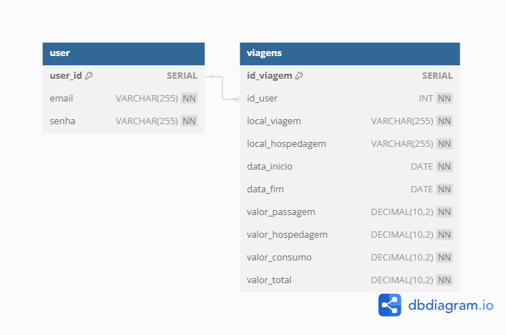

## Router Airplane - Planejamento de Viagens

### Índice
1. [Descrição](#descrição)
2. [Integrantes](#integrantes)
3. [Ferramentas Utilizadas](#ferramentas-utilizadas)
4. [Modelo Físico](#modelo-físico)
5. [Scripts SQL](#scripts-sql)
6. [Código Fonte do CRUD](#código-fonte-do-crud)
7. [Instalação do Ambiente React.js](#instalação-do-ambiente-reactjs)

### Descrição
O Router Airplane é um sistema para gerenciamento de viagens, controle de gastos e datas. Nele você salva e controla suas próximas viagens tendo acesso a valores gastos na viagem, datas de início e fim, local de ida e hospedagem. Com controle de usuários para não perder seus registros, barra de busca para encontrar a viagem que deseja e visualização do local da viagem detalhada através da API do Google Maps (Places).

### Integrantes
Luiz Antônio Bezerra - [BezzeraLuiz](https://github.com/BezerraLuiz)<br>
...

### Ferramentas Utilizadas
- React.js
- HTML, CSS e JS
- Java
- PostgreSQL
- API Google Maps (Places)

### Modelo Físico
Utilizado a ferramenta de modelagem de dados [dbdiagram.io](https://dbdiagram.io/) para criação do modelo físico do banco de dados, para posterior exportação dos scripts DDL das tabelas e relacionamentos.<br>
Arquivo fonte: [Modelo Físico](https://dbdiagram.io/d/66c3ad358b4bb5230e851997).<br>



### Scripts SQL
Para este projeto foi utilizado o banco de dados [PostgreSQL].<br>

#### Criando um Banco de Dados PostgreSQL no Windows

1. **Instalar o PostgreSQL**
   - **Baixar:** [PostgreSQL para Windows](https://www.postgresql.org/download/windows/).
   - **Instalar:**
     - Execute o instalador.
     - Defina a senha para o usuário `postgres`.
     - Instale componentes como servidor PostgreSQL, pgAdmin e Stack Builder.

2. **Configurar Variáveis de Ambiente (opcional)**
   - Adicione o caminho `C:\Program Files\PostgreSQL\X.X\bin` à variável `Path`:
     - Vá para "Painel de Controle" > "Sistema" > "Configurações avançadas do sistema".
     - Clique em "Variáveis de Ambiente" e edite `Path`.

3. **Acessar o PostgreSQL**
   - **pgAdmin:**
     - Abra o pgAdmin, crie um servidor (`localhost`) e use a senha definida.
   
   - **psql:**
     - No prompt de comando, digite `psql -U postgres` e insira a senha.

4. **Criar um Novo Banco de Dados**
   - **pgAdmin:**
     - Clique com o botão direito em "Databases" > "Create" > "Database...".
   
   - **psql:**
     - Execute `CREATE DATABASE nome_do_banco;` para criar o banco.

5. **Configurar e Testar**
   - Configure tabelas e usuários conforme necessário.
   - Teste a conexão via `psql` ou pgAdmin.

Abaixo, segue o script SQL:
+ [DDL](https://github.com/BezerraLuiz/planejamento-viagem/tree/main/database/DDL)

### Código Fonte do CRUD
- Linguagem de Programação Java<br>
- Framework SpringBoot
- JavaSPA e PostgreSQL driver

### Instalação do Ambiente React.js

Para configurar o ambiente React.js, siga os passos abaixo:

1. **Clonar o Repositório**
   - Abra o prompt de comando ou terminal e execute:
     ```bash
     git clone https://github.com/BezerraLuiz/planejamento-viagem.git
     ```
   - Navegue até o diretório do projeto:
     ```bash
     cd planejamento-viagem
     ```

2. **Instalar Dependências**
   - Execute o seguinte comando para instalar as dependências do projeto:
     ```bash
     npm install
     ```

3. **Iniciar o Servidor de Desenvolvimento**
   - Após a instalação das dependências, inicie o servidor de desenvolvimento com:
     ```bash
     npm run dev
     ```
   - Isso abrirá seu navegador padrão com a aplicação React em execução.
  
### Inicialização do Backend

Para configurar o backend, siga os passos abaixo:

1. **Inicie o App.java**
   - Execute o App.java localizado na pasta backend para conectar ao banco.

O código-fonte do projeto pode ser encontrado no repositório do GitHub: [Código Fonte](https://github.com/BezerraLuiz/planejamento-viagem/tree/main/frontend)
